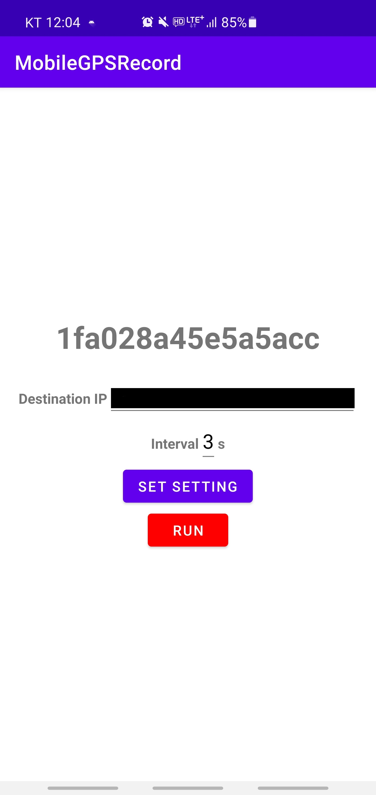
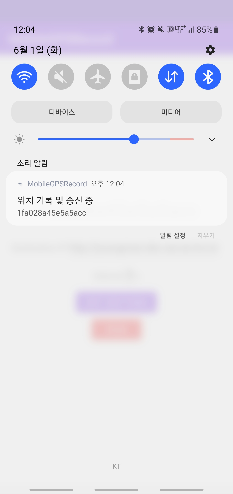
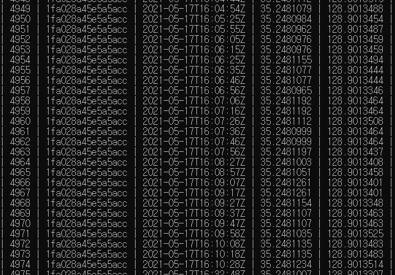

# GPS_Mobile
===
Summary
---
This Application is for recording GPS data(Latitude, Longitude).

And this Application works at Foreground.(Not Background Application...)

DataBase use 'ANDROID_ID' as Key for identificate User.

+ Mobile
    + Java Application
+ Server
    +  Node.js(Rest.api)
+ DataBase
    + Mysql

Work
---
+ Application

+ Foreground

+ DataBase

   
Enviroment
---
+ You need .env setting in Server
    + Mysql(Keys)
        + ADDRESS
        + DATABASE
        + IDENTIFICATION
        + PASSWORD
        + PORT
    + IDENTIFICATION
        + NUMBER
   
+ DataBase Table(gps_record)
    + MAC
    + TIME
    + Latitude
    + Longitude

Commit Log
---
+ 1.0.0
    + created Structure
        + Mobile
        + Server
            + created index.js
            + .gitignore
   
+ 1.0.1
    + created MYSQL
        + created .env        
   
+ 1.1.0
    + Improved Structure
        + merged mysql.js
    + database connection
    + Mobile Application
        + created Test Mobile application
        + created package
   
+ 1.2.0
    + Complete GPS Mobile Application            